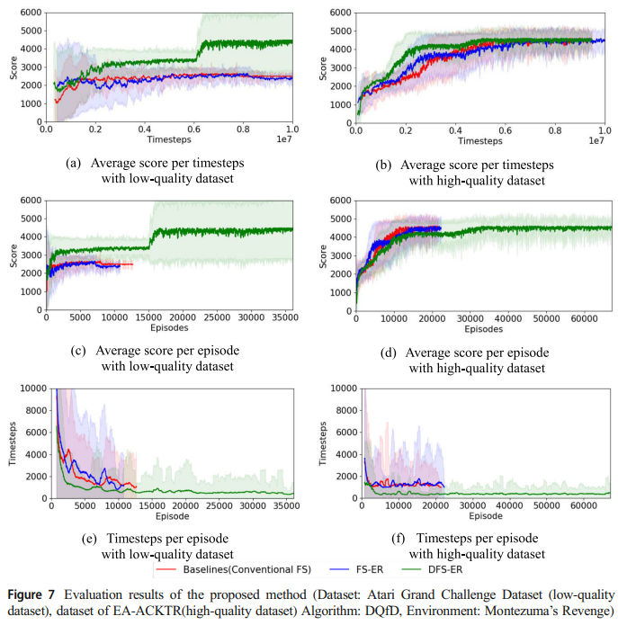

# DFS_ER : 동적 프레임스키핑을 통한 휴먼 데몬스트레이션 데이터를 활용한 강화학습에서의 성능향상 기법


## 1. Motivation
---------------------
* 게임 환경에서의 고품질의 휴먼 데몬스트레이션 데이터를 얻기 위해선 높은 비용이 필요하다.
* 일반적으로 Atari 게임을 활용하여 강화학습에 대한 연구가 진행되나, 이들이 활용하는 고품질의 휴먼 데몬스트레이션 데이터는 법적인 문제로 인해 공유가 어렵다.
* 따라서 오픈소스로 공유되어지는 휴먼 데몬스트레이션 데이터를 활용해야하지만, 이러한 데이터는 품질을 보장할 수 없을 뿐만 아니라, 학습하고자하는 게임에 대한 데이터가 없을 수도 있다.
* 즉, 휴먼 데몬스트레이션 데이터에 대한 효과적인 활용이 반드시 필요하다.

----
## 2. Objective
-----
* 휴먼 데몬스트레이션 데이터를 강화학습에서 효과적으로 활용하는 방안을 제시한다. 
* 기존 휴먼 데몬스트레이션 데이터를 활용하는 강화학습에 제안기법을 적용하여 기존 방식 대비 두 가지 목적 중 하나를 달성한다.
  * 기존 대비 수렴 스코어에 도달하는 시간이 더 빨라진다.
  * 기존 대비 더 높은 수렴 스코어에 도달할 수 있다.
----
## 3. Dynamic Frame Skipping - Experience Replay (DFS-ER)
----
* 일반적인 휴먼 데몬스트레이션 데이터는 샘플링 시, 고정된 frame skipping 을 설정하고 state를 구성한다. 이때, frame 과 state는 다음과 같이 정의된다.
  * frame : 캡쳐된 게임의 한 장면
  * state : 다수의 frame을 적충하여 구성한 실제 신경망을 위한 입력데이터 

* 그러나, 이러한 방식은 특정 행위에 대하여 얼마나 길게 행위를 지속하는지에 대하여 학습하기 어렵게 한다. 
* 만약 frame skipping rate를 human demonstration data로 부터 학습하게 된다면 다음과 같은 이점이 생긴다. 
  * 사람이 특정 행위를 특정 상황에서 얼마나 길게 유지하는지 확인할 수 있다. 
  * 강화학습 에이전트가 이것을 학습하게 된다면, 해당 상황에서 행위를 길게 유지하게 된다. 결과적으로 에피소드 별 행위를 결정하는 빈도가 감소한다.
  * 강화학습 에이전트가 생성된 경험은 행위의 지속성을 고려한 경험이 되므로 기존 대비 더 가치있는 경험이 되며, 학습의 효율성이 증가한다.  

* 휴먼 데몬스트레이션 데이터를 읽어 행위의 지속성을 확인하고, 행위가 길게 지속되는 경우에는 강화학습 에이전트도 행위를 길게 지속하도록 행위공간을 변경시킨다. 

## 4. Experiment Results
-----
### 4.1 Atari grand challenge dataset를 활용한 실험.

* 이 실험에서 활용한 Atari grand challenge dataset의 경우, 비교적 높은 점수의 휴먼 데몬스트레이션 데이터를 가지고 있지 않음 
  * 여기서 비교적이란, 구글의 DQfD 실험의 최고스코어 데이터와 비교
* 실험은 세가지 그룹을 정의하여 비교함.
  * Single : 일반적인 frame skipping을 적용한 경우
  * FS-ER : 60Hz의 human demonstration data를 전부 활용한 경우.
  * DFS-ER : 제안 기법
* 제안 기법은 DQfD 에 적용됨.  
* 이 실험에서는 비교적 학습이 쉬운 게임(Dense-reward environment) 에서 비교함. 


* 실험 결과 : 최대 60.3 % 의 스코어 상승이 확인됨. 

</img>

-----

### 4.2 휴먼 데몬스트레이션 데이터의 품질 별 비교 
----
* Atari 게임 중, Spare-reward 환경의 게임 중 하나인 Montezuma's Revenge를 학습하여 품질에 따른 학습 성능 차이를 비교함. 
* 실험 결과 
  * 저품질 휴먼 데몬스트레이션 데이터를 활용한 경우 DFS-ER이 더 높은 수렴 점수에 도달하였으나, 고품질 휴먼 데몬스트레이션 데이터를 활용하는 경우에는 실험 스텝 내에 모든 방식이 동일한 수렴 점수에 도달함. 
  * DFS-ER은 다른 기법 대비 동일한 타임스텝 내에 179.8%~230% 더 많은 에피소드를 탐색함. 
  
</img>

----

### 4.3 최신 모델로의 적용

----

* 제안 기법을 그 당시(2019) 최신 모델 중 하나인 EA-ACKTR에 적용함. 
* 실험 그룹 
  * EA-ACKTR : 기본 EA-ACKTR 방식
  * EA-ACKTR with DFS-ER : 기본 EA-ACKTR에 DFS-ER을 적용
* 실험결과
  * 최종 수렴 정확도 상승
    * EA-ACKTR (29,285), EA-ACKTR with DFS-ER (33,034)
    * DQfD에 적용했을때와 달리 소폭의 에피소드 수 증가(3.3%)
      * 이것은 제안기법 적용 시 에이전트가 죽지 않고 오래살아남아 에피소드 수가 크게 증가하지 않은것으로 가정.

</img>


## 5. 실행방법. 

------
### 5.1 Dependency 
------
* 실험 자체가 2019년에 진행되어 dependency가 확실하지 않음. 
* Tensorflow 1.8 
* OpenAI gym 
* Low quality demonstration data : Atari Grand Challenge Dataset (version 1)
* High quality demonstration data : EA-ACKTR 깃헙에서 제공되는 Montezuma's revenge 휴먼 데몬스트레이션 데이터를 활용함. 

-------
### 5.2 실행
--------
* 폴더 별로 DQfD에 대한 실험, EA-ACKTR에 제안기법을 적용한 경우로 나뉘어짐.
* 휴먼 데몬스트레이션 데이터는 스코어순으로 내림차순 정렬 후, 버퍼가 다 채워질때까지 Replay buffer에 추가함. 
* 4.1 실험
  * learning rate와 $\lambda_1$, $\lambda_2$, $\lambda_3$, $\lambda_4$ 값은 Config.py를 통해 설정. 

| 하이퍼 파라미터 | 값 |
|:---|---:|
|human replay buffer 크기 | 50,000|
|actor replay buffer 크기 | 12,500|
|미니배치 크기 | 32|
|전체 pretraining step | 500,000|
|전체 강화학습 스텝 | 1,000,000|
|learning rate | 0.0001|
|$fs_1$  and $fs_2$ | 4, 12|
|$fs_{2condition}$ | 70 |
| $\lambda_1$, $\lambda_2$, $\lambda_3$, $\lambda_4$ | 1.0, 1.0, 1.0, 0.0001 |
|최대 에피소드 길이 | 50,000 


```
 cd dfs_er_dqfd
 python Trainer.py [setting hyper pameters..]
```
* 4.2 실험

| 하이퍼 파라미터(4.1실험 대비 변경 부분) | 값 |
|:---|---:|
|human replay buffer 크기(DFS-ER) | 174,000|
|actor replay buffer 크기 | 500,-00|
|미니배치 중 휴먼 데이터 수 | 8(25%)|
|전체 pretraining step | 750,000|
|전체 강화학습 스텝 | 9,250,000|

```
 cd dfs_er_dqfd
 python Trainer.py [setting hyper pameters..]
```

* 4.3 실험 

| 하이퍼 파라미터 | 값 |
|:---|---:|
|human replay buffer 크기 | 172,548 (14 에피소드)|
|환경의 수  | 32|
|1 학습 스텝 당 환경 스텝의 수 | 20|
|휴먼 미니배치의 수 | 256|
|강화학습 스텝 수| 90,000,000|
|learning rate | 0.125|
|$fs_1$  and $fs_2$ | 4, 12|
|$fs_{2condition}$ | 110 |


```
 cd dfs_er_eacktr/baselines/acktr
 #train 함수의 r2_cond, r2_skip 옵션이 
 #각각 fs_2condition, fs_2 에 매칭되는 하이퍼파라미터임. 
 python run_atari_training.py 
```